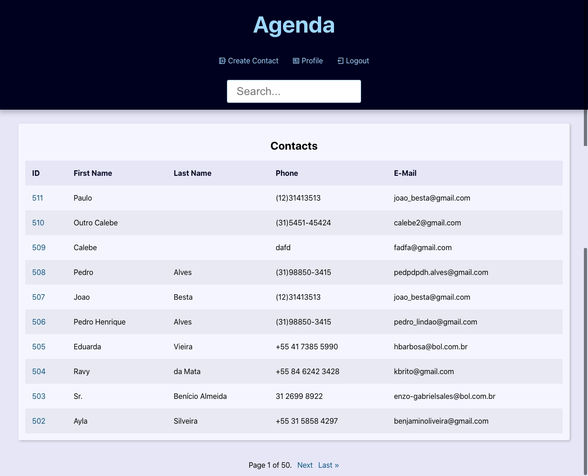

# Projeto Agenda - Django

## Descrição

Este projeto é uma aplicação de agenda desenvolvida em Django. Ele permite aos usuários criar, editar e visualizar contatos em formato de uma agenda telefônica.

<style> 
    img {
        width: 50%;
        display: block;
        margin: auto;
        align-items: center;

    }
</style>

## Funcionalidades

### Métodologia CRUD de contatos.
- Criação de contatos por qualquer perfil, com nome, telefone, email, imagem e etc.


- Visualização de contatos, sendo permitido apenas alterações por aqueles que criaram o contato.

 

### Criação de perfis.
- Criação de perfis com username e senha, sendo a última uma senha forte, garantindo a segurança.


- Se não tiver um usuário, basta criá-lo.


### Visualizar todos os contatos de maneira organizada, paginada e rápida!
- Opção de busca por id, nome, telefone, email e sobrenome.
- Tela minimalista e fácil uso.



<hr>

## Requisitos

- Python 3.6+
- Django 3.2+
- SQLite (ou outro banco de dados suportado pelo Django)

<hr>

## Instalação

1. Clone o repositório do projeto:

    ```bash
    git clone https://github.com/seuusuario/projeto-agenda.git
    ```

2. Navegue até o diretório do projeto:

    ```bash
    cd projeto-agenda
    ```

3. Crie um ambiente virtual e ative-o:

    ```bash
    python -m venv venv
    source venv/bin/activate  # No Windows use `venv\Scripts\activate`
    ```

4. Instale as dependências do projeto:

    ```bash
    pip install -r requirements.txt
    ```

5. Aplique as migrações para configurar o banco de dados:

    ```bash
    python manage.py migrate
    ```

6. Crie um superusuário para acessar o admin do Django:

    ```bash
    python manage.py createsuperuser
    ```

7. Inicie o servidor de desenvolvimento:

    ```bash
    python manage.py runserver
    ```

8. Acesse a aplicação no seu navegador em `http://localhost:8000`.

<hr>

## Uso

- Navegue até `http://localhost:8000/admin` e faça login com o superusuário criado.
- Adicione, edite e remova eventos e compromissos na seção de administração.
- Visualize a agenda na interface principal da aplicação.